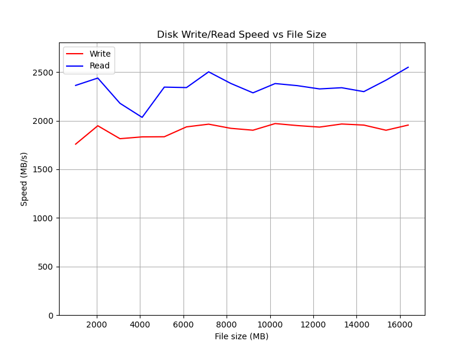
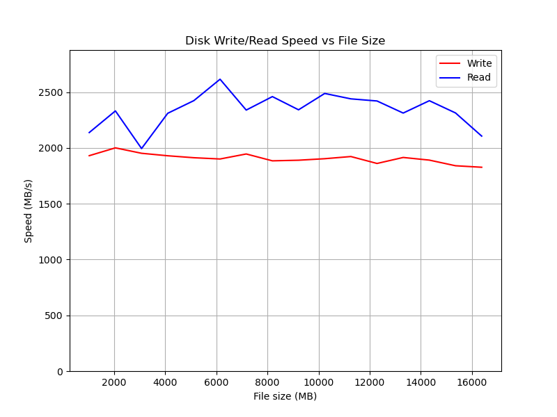
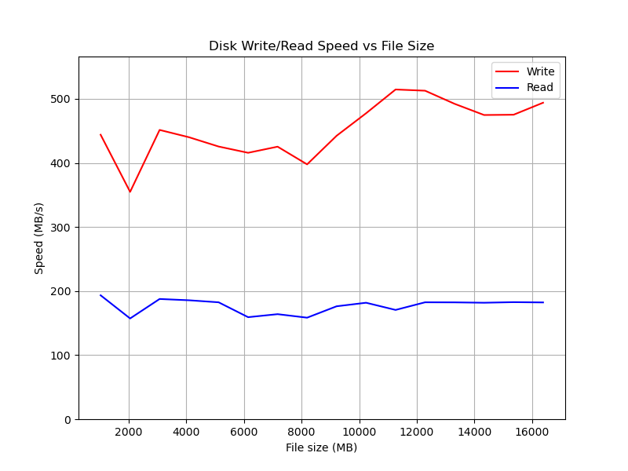
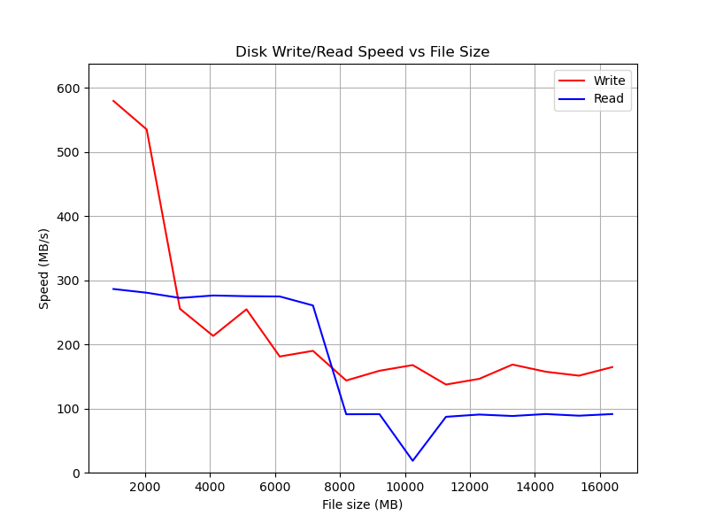

disk_benchmark
--------------
**disk_benchmark** is a tool for measuring disk I/O performance (read/write speeds) using different access methods:: read/write, fstrean and mmap.

License
-------
MIT License

Usage
-----
`disk_benchmark [options]`
Options:

  `-min=<size[KMG]>`, `--min=<size[KMG]>`  Minimum file size (default: 1M)
  
  `-max=<size[KMG]>`, `--max=<size[KMG]>`  Maximum file size (default: 10M)
  
  `-s=<size[KMG]>`, `--s=<size[KMG]>`      Stride size (default: 1M)
  
  `-buf=<size[KMG]>`, `--buf=<size[KMG]>`  Memory buffer size (default: 1M)
  
  `-f=<[rw|mm|fs]>`, `--f=<[rw|mm|fs]>`    Functions for file 
  operation:
  
  `rw` - read/write
  `prw` - pread/pwrite
  `mm` - mmap
  `fs` - fstream
  
  `-n=<N>`, `--n=<N>`                      Number of iterations (default: 1)
  
  `-r`, `--r`                              Use RAM disk (default: not used)
  
  `-p`, `--plot`                           Enable plotting graph (default: off)
  
  `-h`, `--help`                           Show the help message and exit;

Building
--------

1. Download the matplotlib-cpp header-only library:

`git clone https://github.com/lava/matplotlib-cpp.git`

Copy files `external/matplotlib-cpp`

2. install Python3 and Matplotlib
on macOS:

```
brew install cmake python3
brew install python-matplotlib
```

3. Check your Python 3 path:
`which python3`

Update the CMakeLists.txt if needed, e.g., set Python path to `/usr/local/bin/python3` on Intel Macs.

4. Build the project:

```
mkdir build && cd build
cmake ..
make
```
Example
-------
 ./disk_benchmark -min=1G -max=16G -buf=10M -s=1G -f=rw -p

Results on MacBook Pro 2017, 16GB (for example):

read/write
----------

```
Configuration:
  Functoins:     read/write
  Min      1073741824 B (1.00 GiB)
  Max      17179869184 B (16.00 GiB)
  Stride   1073741824 B (1.00 GiB)
  Memory buffer: 10485760 B (10.00 MiB)
  Iterations:    1
  Use RAM disk:  no
  Plot graph:    yes
```
Size, MiB | Write, MiB/s | Read, MiB/s
----------|--------------|------------
1024      | 1758.43      | 2362.75
2048      | 1947.59      | 2438.31
3072      | 1814.49      | 2178.71
4096      | 1833.2       | 2033.92
5120      | 1834.51      | 2345.16
6144      | 1936.13      | 2340.43
7168      | 1963.89      | 2502.35
8192      | 1921.15      | 2382.98
9216      | 1901.79      | 2286.33
10240     | 1970.19      | 2381.83
11264     | 1949.51      | 2360.25
12288     | 1933.74      | 2326.57
13312     | 1965.66      | 2338.93
14336     | 1954.56      | 2298.68
15360     | 1901.43      | 2416.54
16384     | 1954.62      | 2549.4


read/write

pread/pwrite
----------

```
Size, MiB | Write, MiB/s | Read, MiB/s
----------|--------------|------------
1024      | 1931.24      | 2138.58
2048      | 2001.3       | 2332.5
3072      | 1952.66      | 1995.3
4096      | 1930.44      | 2311.21
5120      | 1912.85      | 2424.93
6144      | 1901.61      | 2616.48
7168      | 1946.5       | 2340.02
8192      | 1885.06      | 2460.77
9216      | 1890.52      | 2342.49
10240     | 1904.1       | 2488.88
11264     | 1923.55      | 2440.56
12288     | 1861.45      | 2421.46
13312     | 1915.22      | 2313.24
14336     | 1891.47      | 2423.95
15360     | 1841         | 2314.27
16384     | 1827.47      | 2106.78
```

pread/pwrite

mmap
----

```
Configuration:
  Functoins:     mmap
  Min      1073741824 B (1.00 GiB)
  Max      17179869184 B (16.00 GiB)
  Stride   1073741824 B (1.00 GiB)
  Memory buffer: 10485760 B (10.00 MiB)
  Iterations:    1
  Use RAM disk:  no
  Plot graph:    yes
  ```
Size, MiB | Write, MiB/s | Read, MiB/s
----------|--------------|------------
1024      | 443.966      | 193.353
2048      | 354.792      | 157.224
3072      | 451.45       | 187.616
4096      | 439.999      | 185.591
5120      | 425.556      | 182.436
6144      | 415.764      | 159.222
7168      | 425.328      | 163.922
8192      | 397.741      | 158.43
9216      | 442.341      | 176.213
10240     | 477.497      | 181.745
11264     | 514.568      | 170.522
12288     | 512.677      | 182.451
13312     | 492.207      | 182.341
14336     | 474.738      | 181.758
15360     | 475.178      | 182.671
16384     | 493.915      | 182.241


mmap

fstream
-------
```
Configuration:
  Functoins:     fstream
  Min      1073741824 B (1.00 GiB)
  Max      17179869184 B (16.00 GiB)
  Stride   1073741824 B (1.00 GiB)
  Memory buffer: 10485760 B (10.00 MiB)
  Iterations:    1
  Use RAM disk:  no
  Plot graph:    yes
```
Size, MiB | Write, MiB/s | Read, MiB/s
----------|--------------|------------
1024 MB   | 579.929      | 286.428
2048 MB   | 535.381      | 280.634
3072 MB   | 255.521      | 272.476
4096 MB   | 213.205      | 276.312
5120 MB   | 254.752      | 275.207
6144 MB   | 181.104      | 274.81
7168 MB   | 189.973      | 260.749
8192 MB   | 143.673      | 91.0297
9216 MB   | 158.887      | 91.1805
10240 MB  | 167.723      | 18.4179
11264 MB  | 137.364      | 87.0464
12288 MB  | 146.27       | 90.5788
13312 MB  | 168.546      | 88.3054
14336 MB  | 157.363      | 91.3575
15360 MB  | 151.211      | 88.7708
16384 MB  | 164.617      | 91.33


fstream
